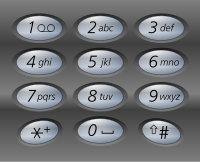

## Letter Combinations of a Phone Number

Given a digit string, return all possible letter combinations that the number could represent.

A mapping of digit to letters (just like on the telephone buttons) is given below.

[](https://raw.github.com/yning/Interview-Questions/master/telephone.png)

```
Input:Digit string "23"
Output: ["ad", "ae", "af", "bd", "be", "bf", "cd", "ce", "cf"].
```

Run the program:
```
python letter_combinations_of_phone_number.py
```
